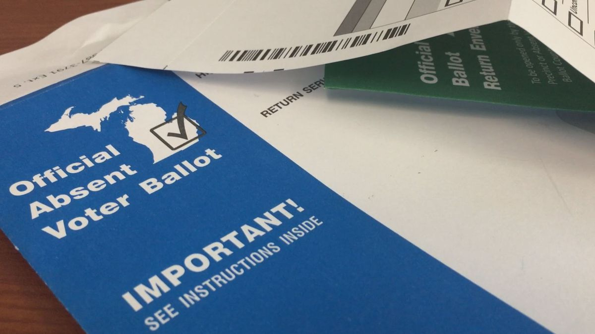
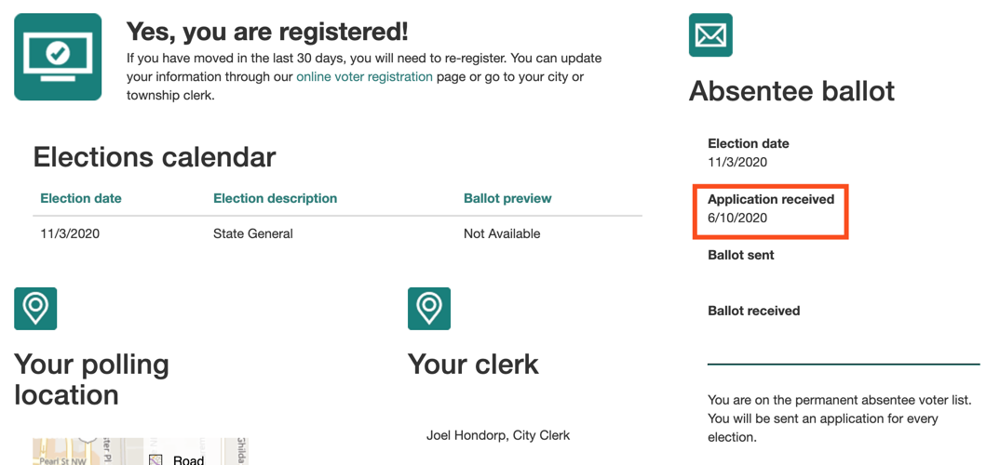
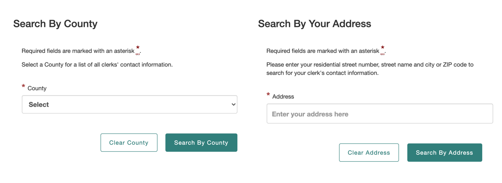

## 1. Check for absentee voting status

Maybe you've already requested to receive your ballots by mail. Let's find out!

Visit the [https://mvic.sos.state.mi.us/Voter/Index](https://mvic.sos.state.mi.us/Voter/Index) and look up your voter registration status:

Make sure to enter your **full legal name** and the ZIP code of your last registered address. When you submit that form, you should see something like this:

If your registration page indicates that your absentee application has been received, then congratulations, you're all set! You can skip to [step 5](#bottom).

## 2a. Complete the online absent voter ballot application

Due to the passage of the statewide ballot [proposal 18-3](https://ballotpedia.org/Michigan_Proposal_3,_Voting_Policies_in_State_Constitution_Initiative_(2018)), all registered voters in Michigan can now request an absent voter ballot without needing to provide a reason.

This can be done using the online form: [https://mvic.sos.state.mi.us/avapplication](https://mvic.sos.state.mi.us/avapplication)

Once completed, you can skip to step 3.

## 2b. Or email the application to your clerk

Alternatively, a fillable PDF is available for download: [https://www.michigan.gov/sos/0,4670,7-127-1633_8716_8728-21037--,00.htm](https://www.michigan.gov/sos/0,4670,7-127-1633_8716_8728-21037--,00.htm)

Either print, complete, and scan your completed application or use PDF software to insert a digital signature. Then, find your local clerk's email address here:
[https://mvic.sos.state.mi.us/clerk](https://mvic.sos.state.mi.us/clerk)

Attach your **signed application** to an email similar to the following:

> Dear City Clerk,
>
> I would like to receive an absentee ballot for all future Michigan elections.
> Attached is my completed application I downloaded from the MI SOS website.
>
> Thanks, 
> \<Your Name>

They should reply to your email within a few days confirming it was received.

## 3. Confirm your absentee status

After your local clerk receives your request to vote by mail, it may take a few more days for that fact to be reflected on your registration status.

Resubmit the form in [step 1](#top) every few days until it shows that your application has been received:

## 5. Wait for your absentee ballot

As long as you have completed these steps no later than 5 p.m. the Friday before an election, your clerk will mail you an absentee ballot to fill out and return:

Carefully sign the return envelope. Your signature should match your driver's license. You have until 8 p.m. on election day to return the ballot to your clerk's office via mail or [drop box](https://www.michigan.gov/documents/sos/Ballot_Dropbox_Locations_697191_7.pdf). To ensure your ballot is counted, return it as soon as possible!

You can track the status of your ballot using the same form in [step 1](#top):

Additional information can be found here: [https://www.michigan.gov/sos/0,4670,7-127-1633_8716_8728-21037--,00.html](https://www.michigan.gov/sos/0,4670,7-127-1633_8716_8728-21037--,00.html)

Stay safe and happy voting!
